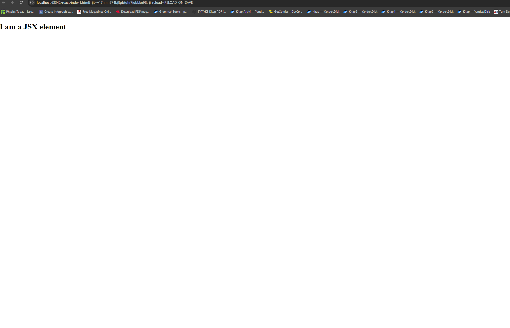
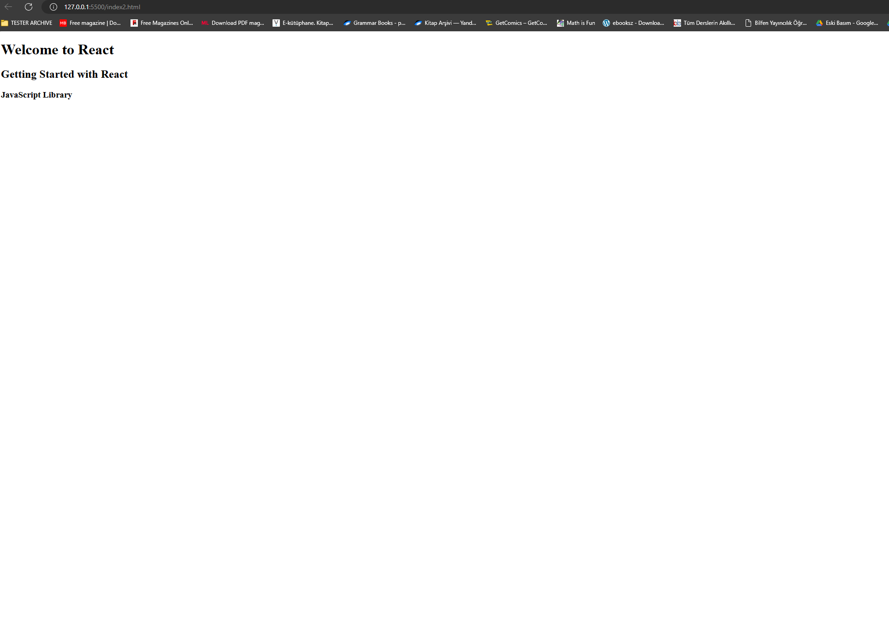
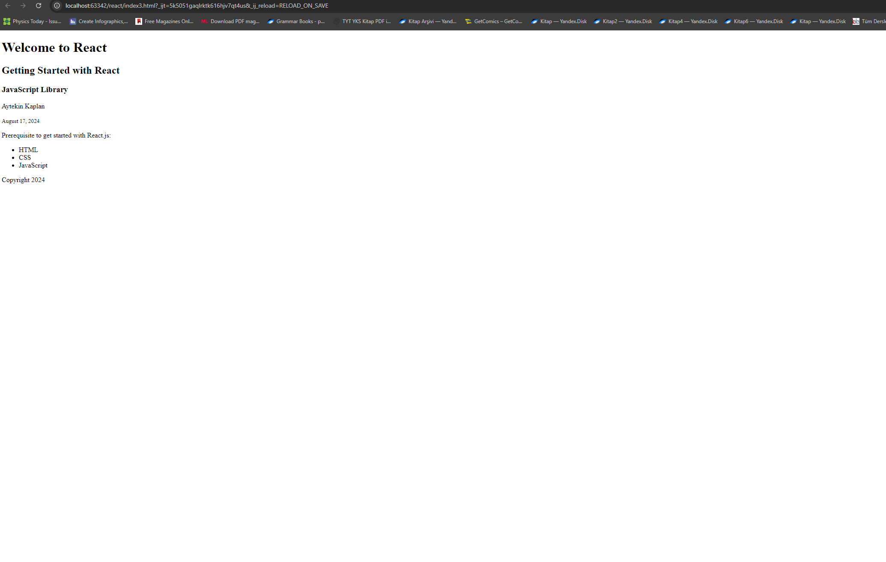
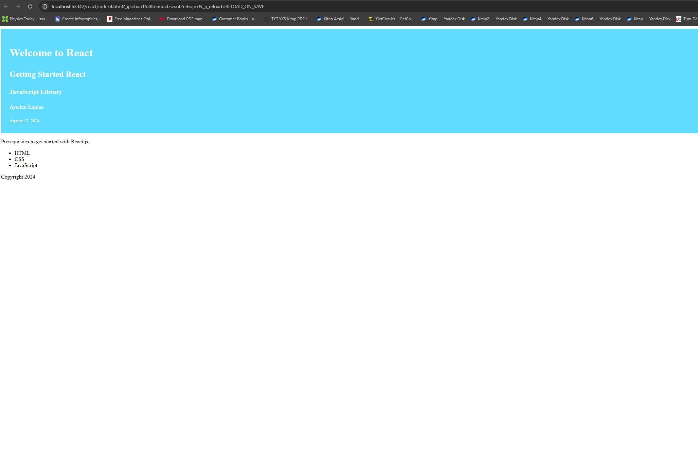

## Getting Started React

This section covers prerequisites to get started with React.You should have a good understanding of the following
technologies:

- HTML
- CSS
- JAVASCRIPT

If you have the skills mentioned above, you will enjoy doing React. The 30 Days Of React challenge contains everything you need to know about react. In every section, it has some exercises and mini-projects, and it is recommended to work on them. This 30 Days Of React challenge will help you learn the latest version of React and the old version, step by step. The topics are broken down into 30 days, where each day contains several topics with easy-to-understand explanations, real-world examples and many hands-on exercises.
This challenge is designed for beginners and professionals who want to build a web application using React and JavaScript.
Once in a while you may need different dummy data to work with React.

### 1. What is React?

React is a JavaScript library for building a reusable user interface(UI). It was initially released on May 29, 2013. The current version is 16.13.1 and somehow it is stable. React was created by Facebook. React makes creating UI components very easy. The official React documentation can be found [here](https://reactjs.org/docs/getting-started.html). When we work with React we do not interact directly with the DOM. React has its own way to handle the DOM(Document Object Model) manipulation. React uses its virtual DOM to make new changes and it updates only the element, that needs changing. Do not directly interact with DOM when you build a React Application and leave the DOM manipulation job for the React virtual DOM. In this challenge, we will develop 10-15 web applications using React. A web application, or a website, is made of buttons, links, forms with different input fields, header, footer, sections, articles, texts, images, audios, videos and boxes with different shapes. We use react to make a reusable UI components of a website.


### 2. Why React?

React is one of the most popular JavaScript libraries. Many developers and companies have been using it for the last couple of years. Its popularity has been growing fast and it has a huge community. How do we measure popularity? One measure of popularity could be GitHub repository stars, watchers and forks. Let us compare the popularity of [React](https://github.com/facebook/react) and [Vue](https://github.com/vuejs/vue). As of today, the popularity between the two most popular JavaScript looks like as shown on the diagram. From the diagram, you can speculate the most popular JavaScript library. You may look at the number of watchers, stars and forks for both React and Vue. These alone will not be a very good measure of popularity, but still it tells a little bit about the popularity of the two technologies. If I have to recommend another JavaScript library next to React, it would be Vue.js.

Why we choose to use React ? We use it because of the following reasons:

- fast
- modular
- scalable
- flexible
- big community and popular
- open source
- High job opportunity

### 3. JSX

JSX stands for JavaScript XML. JSX allows us to write HTML elements with JavaScript code. An HTML element has an opening and closing tags, content, and attribute in the opening tag. However, some HTML elements may not have content and a closing tag - they are self closing elements. To create HTML elements in React we do not use the _createElement()_ instead we just use JSX elements. Therefore, JSX makes it easier to write and add HTML elements in React. JSX will be converted to JavaScript on browser using a transpiler - [babel.js](https://babeljs.io/). Babel is a library which transpiles JSX to pure JavaScript and latest JavaScript to older version. See the JSX code below.

```js
// JSX syntax
// we don't need to use quotes with JSX

const jsxElement = <h1>I am a JSX element</h1>
const welcome = <h1>Welcome to React Challenge</h1>
const data = <small>Oct 2, 2020</small>
```

The above strange looking code seems like JavaScript and it seems like , but it is not JavaScript and it seems like HTML but not completely an HTML element. It is a mix of JavaScript and an HTML elements. JSX can allow us to use HTML in JavaScript. The HTML element in the JSX above is _h1_ and _small_.

#### JSX Element

As you have seen in the example above, JSX has a JavaScript and HTML like syntax. JSX element could be a single HTML element or many HTML elements wrapped in a parent HTML element.

This JSX element has only one HTML element which is _h1_.

```js
const jsxElement = <h1>I am a JSX element</h1> // JS with HTML
```

Let's make more JSX elements by declaring a new variable named title and content inside _h2_.

```js
const title = <h2>Getting Started React</h2>
```

Let us add a subtitles and other contents to this JSX element by adding additional HTML elements. Every HTML element should be wrapped by an outer HTML element to create a valid JSX element. The name title variable also should be changed to header because our JSX element is containing almost all of the header of the application.

```js
const header = (
  <header>
    <h1>Welcome to React</h1>
    <h2>Getting Started React</h2>
    <h3>JavaScript Library</h3>
  </header>
)
```

Let us keep adding more elements. Additional HTML elements to display the author name and year.

```js
const header = (
  <header>
    <h1>Welcome to React</h1>
    <h2>Getting Started React</h2>
    <h3>JavaScript Library</h3>
    <p>Aytekin Kaplan</p>
    <small>August 16, 2024</small>
  </header>
)
```

As you can see the _header_ element is a parent element for all the inner HTML elements and JSX must be wrapped by an outer parent element. Without the _header_ HTML element or other parent HTML element the above JSX is invalid.

#### Commenting a JSX element

We comment codes for different reasons and it is also good to know how to comment out JSX elements in React.

```js
{
  /*
 <header>
    <h1>Welcome to 30 Days Of React</h1>
    <h2>Getting Started React</h2>
    <h3>JavaScript Library</h3>
    <p>Aytekin Kaplan</p>
    <small>Oct 2, 2020</small>
  </header>

*/
}
```

#### Rendering a JSX Element

To render a JSX element to HTML document, we should first create an index HTML. The index.html is the only HTML file you will have in any React Application. That is why we say that every React Application is a single page application. Let us create an index.html file. We can get started with React in two ways - either by using CDN or create-react-app. The create-react-app creates a React project boilerplate outbox and because of that, many people do have a hard time to understand how React works. In order to make things clear for absolute beginners I would like to start with a CDN. We use CDN only in this section and we will use the create-reap-app in the rest of the challenge and I also recommend you to use only create-react-app all the time.

```html
<!DOCTYPE html>
<html lang="en">
  <head>
    <meta charset="UTF-8" />
    <meta name="viewport" content="width=device-width, initial-scale=1.0" />
    <title>React Challenge</title>
  </head>

  <body>
    <div class="root"></div>

    <script></script>
  </body>
</html>
```

As you can see from the above index.html, we have one div with a class root and script. The root _div_ is the gateway to connect all react components to the index.html. In the script tag we will write our JavaScript, but the script _type_ will be _babel_. Babel will _transpile_ the react JSX to pure JavaScript on the browser. Let us add babel to the script. Inside the babel, we can write any pure JavaScript, JSX and in general any React code.

```html
<!DOCTYPE html>
<html lang="en">
  <head>
    <meta charset="UTF-8" />
    <meta name="viewport" content="width=device-width, initial-scale=1.0" />
    <title>React Challenge</title>
  </head>

  <body>
    <div class="root"></div>
    <script src="https://unpkg.com/@babel/standalone/babel.min.js"></script>
    <script type="text/babel">
      // our code goes here
    </script>
  </body>
</html>
```

The babel library is linked to our document and now we can make use of it. The next step is importing _React_ and _ReactDOM_ using CDN or link. In order to link React and ReactDOM, we attach both packages from CDN to the body of index.html. To test if React is linked to the index.html, try to check it by doing console.log(React). Open the browser console and you should get an object. If you see an object containing React methods then you managed to link your project with React CDN and you are ready to use React.

```html
<!DOCTYPE html>
<html lang="en">
  <head>
    <meta charset="UTF-8" />
    <meta name="viewport" content="width=device-width, initial-scale=1.0" />
    <title>React Challenge</title>
  </head>

  <body>
    <div class="root"></div>

    <script
      crossorigin
      src="https://unpkg.com/react@16/umd/react.development.js"
    ></script>
    <script
      crossorigin
      src="https://unpkg.com/react-dom@16/umd/react-dom.development.js"
    ></script>
    <script src="https://unpkg.com/@babel/standalone/babel.min.js"></script>
    <script type="text/babel">
      console.log(React)
    </script>
  </body>
</html>
```

Now the index.html has everything we need to write React code. Let us get the root element using document.querySelect('.root') and assign it to a variable name rootElement. The is the only place we directly interact with DOM.

Now, you knew JSX and JSX element. Let us render the JSX element on the browser, in order to do so we need the React and ReactDOM library. In addition to the React and ReactDOM we need babel to transpile the JSX to JavaScript code. The ReactDOM package has a method render. The render method takes two arguments:a JSX element or a component and the root document. See the code below. [Live on code pen](https://codepen.io/Aytekin-Kaplan/pen/dyBJwMr).

```html
<!DOCTYPE html>
<html lang="en">
  <head>
    <meta charset="UTF-8" />
    <meta name="viewport" content="width=device-width, initial-scale=1.0" />
    <title>React Challenge</title>
  </head>

  <body>
    <div class="root"></div>

    <script
      crossorigin
      src="https://unpkg.com/react@16/umd/react.development.js"
    ></script>
    <script
      crossorigin
      src="https://unpkg.com/react-dom@16/umd/react-dom.development.js"
    ></script>
    <script src="https://unpkg.com/@babel/standalone/babel.min.js"></script>
    <script type="text/babel">
      // To get the root element from the HTML document
      const rootElement = document.querySelector('.root')

      // JSX element
      const jsxElement = <h1>I am a JSX element</h1>

      // we render the JSX element using the ReactDOM package
      // ReactDOM has the render method and the render method takes two arguments
      ReactDOM.render(jsxElement, rootElement)
    </script>
  </body>
</html>
```


Let us render more content. To render more content, the JSX element should have more HTML elements. For instance, we can create a header of a website and header may have a title, subtitle, author or date etc. Remember, we can render only one JSX element at a time.

```html
<!DOCTYPE html>
<html lang="en">
<head>
    <meta charset="UTF-8"/>
    <meta name="viewport" content="width=device-width, initial-scale=1.0"/>
    <title>React Challenge</title>
</head>
<body>
<div class="root"></div>

<script
        crossorigin
        src="https://unpkg.com/react@16/umd/react.development.js"
></script>
<script
        crossorigin
        src="https://unpkg.com/react-dom@16/umd/react-dom.development.js"
></script>
<script src="https://unpkg.com/@babel/standalone/babel.min.js"></script>
<script type="text/babel">
    // To get the root element from the HTML document
    const rootElement = document.querySelector('.root');

    // Header element
    const header = (
            <header>
                <h1>Welcome to React</h1>
                <h2>Getting Started with React</h2>
                <h3>JavaScript Library</h3>
            </header>
    );

    // Rendering the JSX element using the ReactDOM package
    // ReactDOM's render method takes two arguments:
    // 1. The JSX element to render
    // 2. The DOM element where the JSX should be rendered
    ReactDOM.render(header, rootElement);
</script>
</body>
</html>
```


We have created a JSX element for the header of the website. How about the main and the footer for the website? Similar to the header, let us create a JSX element for the main and the footer.

JSX element for the main part of the website.

```js
// JSX element
const main = (
  <main>
    <p>Prerequisite to get started react.js:</p>
    <ul>
      <li>HTML</li>
      <li>CSS</li>
      <li>JavaScript</li>
    </ul>
  </main>
)
```

JSX element for the footer part of the website.

```js
// JSX element
const footer = (
  <footer>
    <p>Copyright 2020</p>
  </footer>
)
```
Now, we have three JSX elements: the header, main and footer. The best way to render all of the three JSX elements is by wrapping them all in a parent JSX element or putting them in an array. To include JSX element inside another JSX element we use the curly bracket, {} and call the name of the JSX inside the curly bracket.

```js
// JSX element for the header part of the website
const header = (
  <header>
    <h1>Welcome to React</h1>
    <h2>Getting Started React</h2>
    <h3>JavaScript Library</h3>
    <p>Aytekin Kaplan</p>
    <small>August 17, 2024</small>
  </header>
)

// JSX element for the main part of the website
const main = (
  <main>
    <p>Prerequisite to get started react.js:</p>
    <ul>
      <li>HTML</li>
      <li>CSS</li>
      <li>JavaScript</li>
    </ul>
  </main>
)

// JSX element for the footer part of the website
const footer = (
  <footer>
    <p>Copyright 2020</p>
  </footer>
)

// JSX element which contain all, it is a container or parent
const app = (
  <div>
    {header}
    {main}
    {footer}
  </div>
)
```
Now, let us put everything together and render it to the browser. [Live on code pen](https://codepen.io/Aytekin-Kaplan/pen/QWXazQg).

```html
<!DOCTYPE html>
<html lang="en">
<head>
    <meta charset="UTF-8" />
    <meta name="viewport" content="width=device-width, initial-scale=1.0" />
    <title>Welcome to React</title>
</head>
<body>
<div class="root"></div>

<script
        crossorigin
        src="https://unpkg.com/react@16/umd/react.development.js"
></script>
<script
        crossorigin
        src="https://unpkg.com/react-dom@16/umd/react-dom.development.js"
></script>
<script src="https://unpkg.com/@babel/standalone/babel.min.js"></script>
<script type="text/babel">
    // To get the root element from the HTML document
    const rootElement = document.querySelector('.root');

    // JSX element, header
    const header = (
            <header>
                <h1>Welcome to React</h1>
                <h2>Getting Started with React</h2>
                <h3>JavaScript Library</h3>
                <p>Aytekin Kaplan</p>
                <small>August 17, 2024</small>
            </header>
    );

    // JSX element, main
    const main = (
            <main>
                <p>Prerequisite to get started with React.js:</p>
                <ul>
                    <li>HTML</li>
                    <li>CSS</li>
                    <li>JavaScript</li>
                </ul>
            </main>
    );

    // JSX element, footer
    const footer = (
            <footer>
                <p>Copyright 2024</p>
            </footer>
    );

    // JSX element, app, a container or a parent
    const app = (
            <div>
                {header}
                {main}
                {footer}
            </div>
    );

    // We render the JSX element using the ReactDOM package
    // ReactDOM has the render method and the render method takes two arguments
    ReactDOM.render(app, rootElement);
    // or
    // ReactDOM.render([header, main, footer], rootElement)
</script>
</body>
</html>
```


Let us apply some style to our JSX elements and see the result.



Now, lets us apply style the header part only [Live on code pen](https://codepen.io/Aytekin-Kaplan/pen/vYqpvzO).

