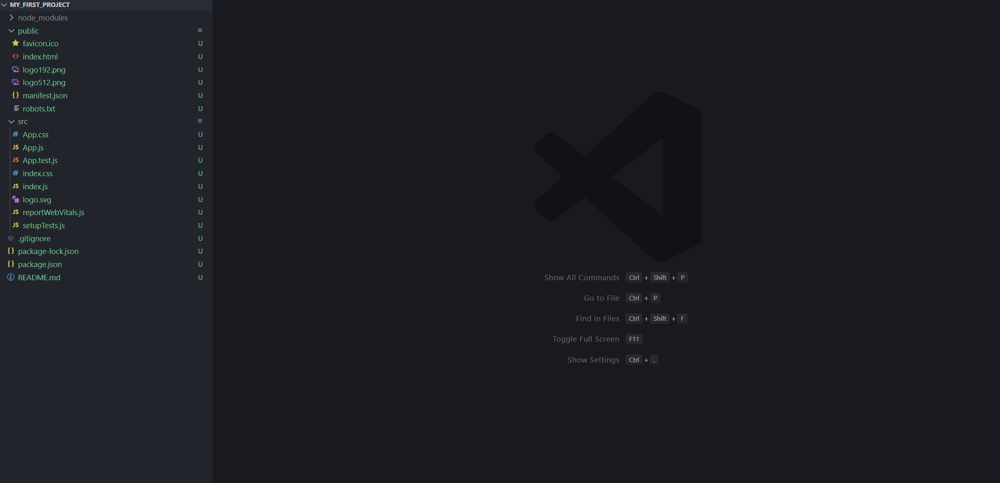
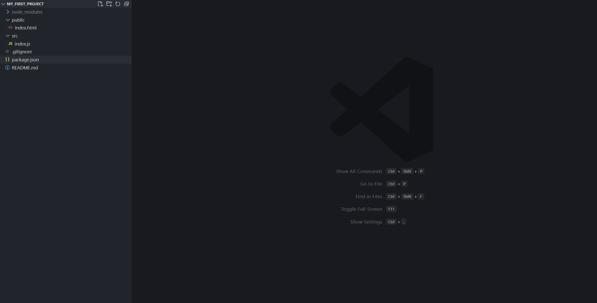
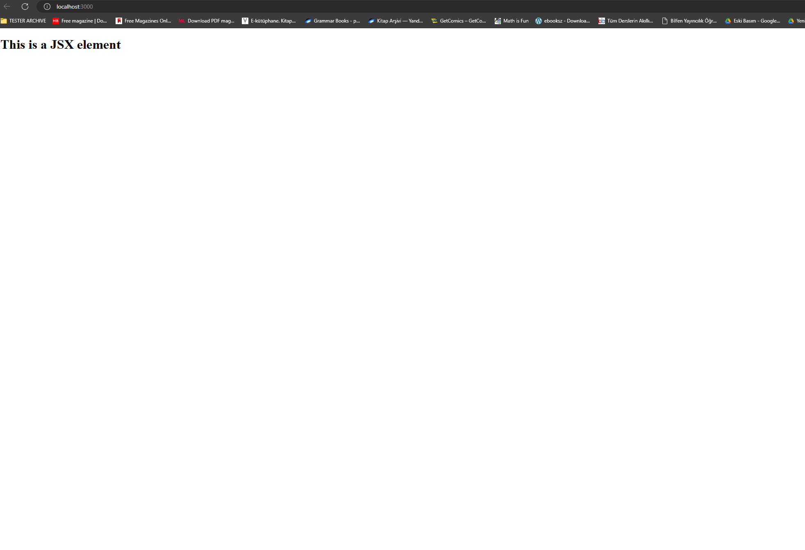
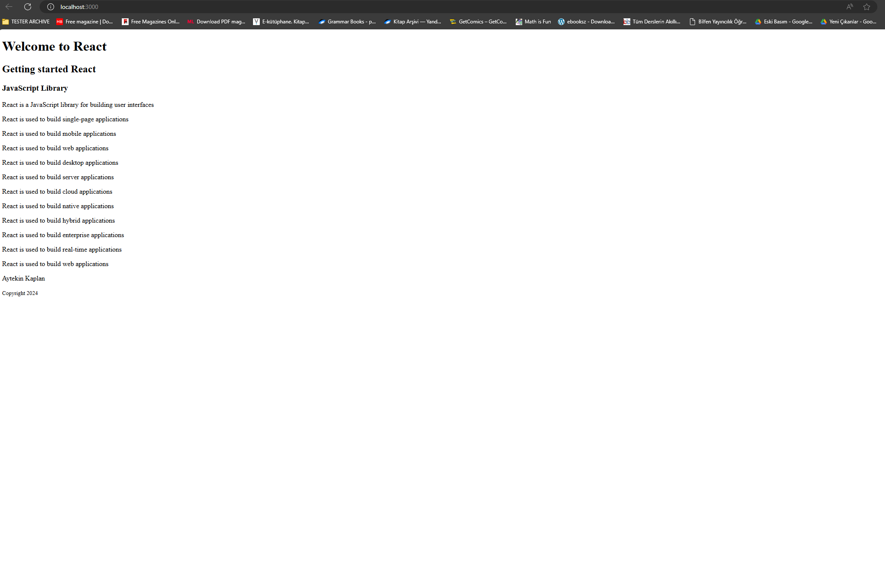
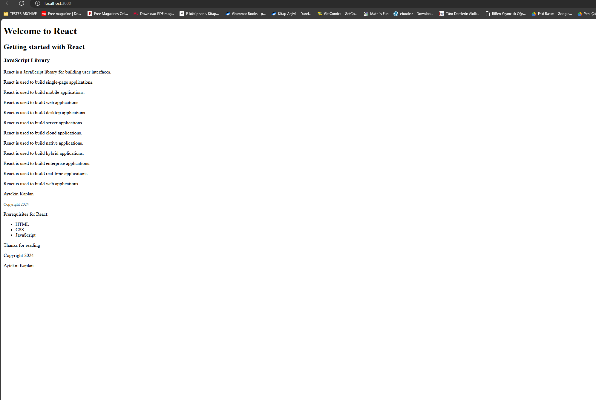
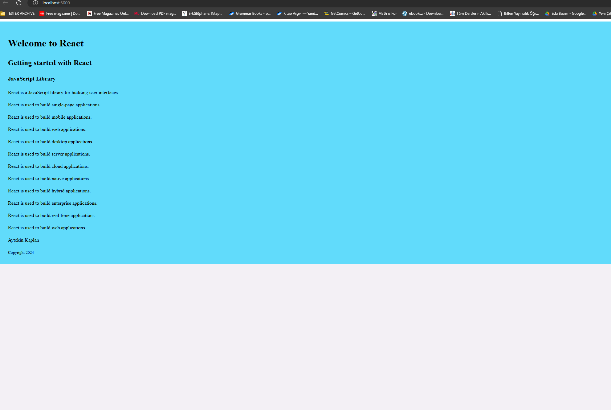
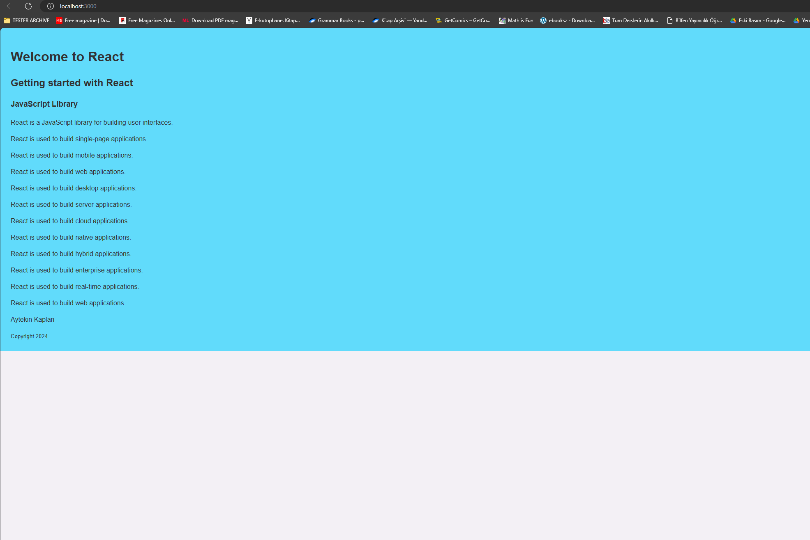

# Setting Up

_create-react-app_ is a package that generates a React project starter (boilerplate), allowing developers to quickly
start their projects. Before its release on July 22, 2016, developers had to manually configure tools like webpack,
babel, and other necessary packages, which could take up to half an hour or more. With _create-react-app_, all of this
configuration is handled automatically, so developers can focus on building the product rather than spending time
setting up the project. This section provides a brief introduction to the tools and technologies used when working with
React, but it's not necessary to fully understand everything right away.

# Node

Node is a JavaScript runtime environment that allows JavaScript to run on the server. It was created in 2009 and has
played a significant role in the growth of JavaScript. React applications, by default, start at localhost 3000. The
_create-react-app_ configures a Node server for the React application, which is why we need Node and node modules. We
will explore _create-react-app_ soon.

If you do not have node, install it. Install [node.js](https://nodejs.org/en/).

After downloading double click and install

We can check if node is installed on our local machine, by opening our device terminal or command prompt, and writing
the following command:

```sh
aytekin $ node -v
v12.18.0
```

## Module

A module in React is a single or a collection of functions that can be exported and imported into a project as needed.
Instead of using links to access modules or packages, React allows you to import them directly into your code. The
section will demonstrate how to import and export modules in React.

```js
// math.js

// Two numbers are added together and the sum is returned.
export const addTwo = (a, b) => {
    console.log(`Adding ${a} and ${b}`);
    return a + b;
};

// Two numbers are multiplied together and the product is returned.
export const multiply = (a, b) => {
    console.log(`Multiplying ${a} by ${b}`);
    return a * b;
};

// The second number is subtracted from the first, and the difference is returned.
export const subtract = (a, b) => {
    console.log(`Subtracting ${b} from ${a}`);
    return a - b;
};

// The default export is an object containing all the above functions,
// providing an easy way to perform basic arithmetic operations.
export default (function doSomeMath() {
    console.log("Math operations are ready to be used.");
    return {
        addTwo,
        multiply,
        subtract,
    };
})();
```

## Package

A Package is a module or a collection of modules. For instance, React, ReactDOM are packages.

## Node Package Manager(NPM)

NPM was created in 2010 and is the default package manager for Node.js. You don't need to install NPM separately, as it
comes bundled with Node.js. NPM allows users to consume and distribute JavaScript modules available in its registry. It
also enables the creation, use, and distribution of packages. NPM has played a significant role in the growth of
JavaScript, and there are currently over 350,000 packages in the NPM registry. The popularity of _create-react-app_ can
be seen by the number of downloads it has on the NPM registry..

## Visual Studio Code

We will use Visual Studio Code as a code editor. [Download](https://code.visualstudio.com) and install it if you do not
have one yet.

## Visual Studio Extensions

You may need to install these extensions from Visual Studio Code

- Prettier
- ESLint
- Bracket Pair Colorizer
- ES7 React/Redux/GraphQL/React-Native snippets

## Browser

We will use Google Chrome

## Create React App

To create a react project you can use one of the following ways. Let's assume you installed node. Open the command line
interface (CLI), git bash or terminal on Mac or Linux. Then run the following command. I am using git bash.

```sh
ytknkpln@aytekin MINGW64 ~/Desktop/my_first_project (main)
$ npx create-react-app name-of-your-project
```

If you don't want to use `npx` every time you create a project, you can install the _create-react-app_ package globally
on your computer with the following command.

```sh
ytknkpln@aytekin MINGW64 ~/Desktop/my_first_project (main)
$ npm install -g create-react-app
```

After installing _create-react-app_, you can create a new React application by running the command
`create-react-app name-of-project`. For example, to create a project named "30-days-of-react", navigate to your desired
directory and run:

```sh
$ npx create-react-app my_first_project
```

After the project is created, navigate into the project directory:

```sh
$ cd my_first_project
```

Then, start the development server:

```sh
$ npm start
```

Your React app will now be running at `localhost:3000`. You can modify the content in `App.js`, and the changes will
automatically reflect in the browser. To stop the server, press `Ctrl + C` in the command line interface.

Here's a summary of the React boilerplate created by _create-react-app_:

When you create a new React project using _create-react-app_, it generates a boilerplate with several key folders and
files:

- **node_modules**: Contains all the necessary Node packages for the React application.

- **public**:

    - `index.html`: The only HTML file in the entire application.
    - `favicon.ico`: An icon file.
    - `manifest.json`: Used to make the application a Progressive Web App (PWA).
    - Other images: Includes open graph images, which are visible when sharing a link on social media.
    - `robots.txt`: Contains information about whether the website allows web scraping.

- **src**:

    - `App.css`, `index.css`: Different CSS files for styling.
    - `index.js`: Connects all components to `index.html`.
    - `App.js`: Where most presentational components are imported.
    - `serviceWorker.js`: Adds PWA features.
    - `setupTests.js`: Used for writing test cases.

- **package.json**: Lists the packages used by the application.
- **.gitignore**: Prevents certain files and folders from being pushed to GitHub.
- **README.md**: A markdown file for writing documentation.
- **yarn.lock** or **package-lock.json**: Locks the package versions.

Before cleaning, the structure of boilerplate


After cleaning up unnecessary files, the structure of the boilerplate is simplified, focusing on the files needed for
immediate development.

Next, you'll work with `index.js`, where you import `React` and `ReactDOM`. React allows you to write JSX, while
`ReactDOM` renders it to the DOM using the `render` method, which takes a JSX element or component and attaches it to
the root.

Here's the corrected and summarized version:

First, we should import `React` and `ReactDOM` into `index.js`. React allows us to write JSX, while `ReactDOM` is used
to render that JSX into the DOM. The `ReactDOM.render` method takes two parameters: a JSX element or component, and the
root element where it should be rendered. Let's apply all the JSX elements we created in the first chapter.

```js
//index.js
// importing the react and react-dom package

import React from "react";
import ReactDOM from "react-dom/client";

const jsxElement = <h1>This is a JSX element</h1>;
const rootElement = document.getElementById("root");

const root = ReactDOM.createRoot(rootElement);
root.render(jsxElement);
```

```html
<!-- index.html -->
<!DOCTYPE html>
<html lang="en">
<head>
    <meta charset="utf-8"/>
    <meta name="viewport" content="width=device-width, initial-scale=1"/>
    <link
            href="https://fonts.googleapis.com/css?family=Montserrat:300,400,500|Roboto:300,400,500&display=swap"
            rel="stylesheet"
    />
    <meta
            name="description"
            content="Web site created using create-react-app"
    />

    <title>React App</title>
</head>
<body>
<div id="root"></div>
</body>
</html>
```

If your application is not running, go to your project folder and run the following command

```sh
ytknkpln@aytekin MINGW64 ~/Desktop/my_first_project (main)
\$ npm start
```

If your code is bug-free, your React app will launch in the browser.



You can then write more JSX elements and render them. For example, you can create a JSX element using an `h2` HTML tag
and display it in the browser.

```js
const title = <h2>Getting Started React</h2>;
```

Let's add more content to the previous JSX and change the name to header.

```js
const header = (
    <header>
        <h1>Welcome to React</h1>
        <h2>Getting Started React</h2>
        <h3>JavaScript Library</h3>
    </header>
);
```

Let's render this to the browser, in order to do so, we need ReactDOM.

```js
//index.js
// importing the react and react-dom package

import React from "react";
import ReactDOM from "react-dom/client";

const header = (
    <header>
        <h1>Welcome to React</h1>
        <h2>Getting started React</h2>
        <h3>JavaScript Library</h3>
        <p>React is a JavaScript library for building user interfaces</p>
        <p>React is used to build single-page applications</p>
        <p>React is used to build mobile applications</p>
        <p>React is used to build web applications</p>
        <p>React is used to build desktop applications</p>
        <p>React is used to build server applications</p>
        <p>React is used to build cloud applications</p>
        <p>React is used to build native applications</p>
        <p>React is used to build hybrid applications</p>
        <p>React is used to build enterprise applications</p>
        <p>React is used to build real-time applications</p>
        <p>React is used to build web applications</p>
        <p>Aytekin Kaplan</p>
        <small>Copyright 2024</small>
    </header>
);
const rootElement = document.getElementById("root");

const root = ReactDOM.createRoot(rootElement);
root.render(header);

```



Now, lets add all the JSX we created

```js
// Import the React library. React is necessary for writing JSX and creating React components.
import React from "react";

// Import the ReactDOM library, which is used to interact with the DOM (Document Object Model) and render React components into the actual web page.
import ReactDOM from "react-dom/client";

// Create a constant named 'header' that stores a JSX element.
// This JSX element represents a header section that includes multiple headings and paragraphs.
const header = (
    <header>
        <h1>Welcome to React</h1>
        // This is an h1 element used as the main title of the page.
        <h2>Getting started with React</h2>
        // This is an h2 element, which serves as a subtitle.
        <h3>JavaScript Library</h3>
        // This h3 element further explains that React is a JavaScript library.
        <p>React is a JavaScript library for building user interfaces.</p>
        // Paragraph explaining what React is.
        <p>React is used to build single-page applications.</p>
        // Describes one of the use cases of React.
        <p>React is used to build mobile applications.</p>
        // Another use case: building mobile apps with React.
        <p>React is used to build web applications.</p>
        // Use case for web applications.
        <p>React is used to build desktop applications.</p>
        // Indicates that React can be used for desktop apps as well.
        <p>React is used to build server applications.</p>
        // Mentions that React can also be applied in server-side apps.
        <p>React is used to build cloud applications.</p>
        // Describes React’s capability in building cloud apps.
        <p>React is used to build native applications.</p>
        // Highlights the ability to create native applications with React (e.g., React Native).
        <p>React is used to build hybrid applications.</p>
        // Points out React’s use in hybrid applications.
        <p>React is used to build enterprise applications.</p>
        // Notes that React can be used for building enterprise-grade applications.
        <p>React is used to build real-time applications.</p>
        // Describes that React is useful for real-time applications.
        <p>React is used to build web applications.</p>
        // Repeats that React is used for web applications.
        <p>Aytekin Kaplan</p>
        // Displays the author's name.
        <small>Copyright 2024</small>
        // A small element displaying copyright information.
    </header>
);

// Create a constant named 'main' that stores another JSX element.
// This JSX element represents the main section, which includes a paragraph and an unordered list.
const main = (
    <main>
        <p>Prerequisites for React</p>
        // A paragraph introducing the prerequisites for learning React.
        <ul>
            <li>HTML</li>
            // A list item stating that knowledge of HTML is required.
            <li>CSS</li>
            // A list item stating that knowledge of CSS is required.
            <li>JavaScript</li>
            // A list item stating that knowledge of JavaScript is required.
        </ul>
    </main>
);

// Create a constant named 'footer' that stores a JSX element.
// This JSX element represents a footer section that includes several paragraphs.
const footer = (
    <footer>
        <p>Thanks for reading</p>
        // A paragraph thanking the reader.
        <p>Copyright 2024</p>
        // A paragraph displaying copyright information.
        <p>Aytekin Kaplan</p>
        // A paragraph with the author's name.
    </footer>
);

// Create a constant named 'app' that combines all the previously defined JSX elements (header, main, footer)
// into a single container (a div element).
const app = (
    <div>
        {header} // Inserts the header JSX element into the div.
        {main} // Inserts the main JSX element into the div.
        {footer} // Inserts the footer JSX element into the div.
    </div>
);

// Render the 'app' JSX element (which contains header, main, and footer) into the root DOM element.
// The root element is the main container in the HTML file where React components are rendered.
ReactDOM.render(app, document.getElementById("root"));
```



## Styles in JSX

Let's apply style to the JSX elements. We can style JSX either using inline, internal or external CSS styles. Now, let's apply inline styles to each JSX element.

```js
// Import the React library, which is required for creating React components and using JSX syntax.
import React from "react";

// Import the ReactDOM library, which allows us to interact with the DOM and render React components into the actual web page.
import ReactDOM from "react-dom/client";

// Define styles for the header using a JavaScript object. These styles will be applied directly to the header element.
const headerStyles = {
  backgroundColor: "#61DBFB", // Sets the background color of the header.
  fontFamily: "Helvetica Neue", // Defines the font family used in the header.
  padding: 25, // Adds padding inside the header.
  lineHeight: 1.5, // Sets the line height for text in the header.
};

// Create a JSX element named 'header' that represents the header section of the page.
// Apply the defined styles to this header using the 'style' attribute.
const header = (
        <header style={headerStyles}>
          <div className="header-wrapper">
            <h1>Welcome to React</h1> // Main title of the header.
            <h2>Getting started with React</h2> // Subtitle of the header.
            <h3>JavaScript Library</h3> // Further explanation of React as a JavaScript library.
            <p>React is a JavaScript library for building user interfaces.</p> // Paragraph describing what React is.
            <p>React is used to build single-page applications.</p> // Paragraph explaining one of the use cases of React.
            <p>React is used to build mobile applications.</p> // Paragraph explaining another use case of React.
            <p>React is used to build web applications.</p> // Paragraph explaining React's use in web apps.
            <p>React is used to build desktop applications.</p> // Paragraph explaining React's use in desktop apps.
            <p>React is used to build server applications.</p> // Paragraph explaining React's use in server-side applications.
            <p>React is used to build cloud applications.</p> // Paragraph explaining React's use in cloud apps.
            <p>React is used to build native applications.</p> // Paragraph explaining React's use in native apps (e.g., React Native).
            <p>React is used to build hybrid applications.</p> // Paragraph explaining React's use in hybrid applications.
            <p>React is used to build enterprise applications.</p> // Paragraph explaining React's use in enterprise-grade applications.
            <p>React is used to build real-time applications.</p> // Paragraph explaining React's use in real-time apps.
            <p>React is used to build web applications.</p> // Repeats that React is used for web applications.
            <p>Aytekin Kaplan</p> // Displays the author's name.
            <small>Copyright 2024</small> // Displays copyright information in a smaller font.
          </div>
        </header>
);

// Define styles for the main section using a JavaScript object. These styles will be applied directly to the main element.
const mainStyles = {
  fontFamily: "Helvetica Neue", // Sets the font family for the main section.
  padding: 25, // Adds padding inside the main section.
  lineHeight: 1.5, // Sets the line height for text in the main section.
  fontSize: 18, // Sets the font size in the main section.
  color: "#333", // Defines the text color in the main section.
  backgroundColor: "#F3F0F5", // Sets the background color of the main section.
  display: "flex", // Uses flexbox layout for the main section.
  flexDirection: "column", // Arranges child elements in a column direction.
  alignItems: "center", // Centers child elements horizontally.
  justifyContent: "center", // Centers child elements vertically.
  minHeight: "100vh", // Ensures the main section takes at least the full viewport height.
};

// Create a JSX element named 'main' that represents the main section of the page.
// Apply the defined styles to this main element using the 'style' attribute.
const main = (
        <main style={mainStyles}>
          <p>Prerequisites for React:</p> // Paragraph introducing prerequisites for learning React.
          <ul>
            <li>HTML</li> // List item stating HTML is a prerequisite.
            <li>CSS</li> // List item stating CSS is a prerequisite.
            <li>JavaScript</li> // List item stating JavaScript is a prerequisite.
          </ul>
        </main>
);

// Define styles for the footer using a JavaScript object. These styles will be applied directly to the footer element.
const footerStyles = {
  backgroundColor: "#61DBFB", // Sets the background color of the footer.
  fontFamily: "Helvetica Neue", // Defines the font family used in the footer.
  padding: 25, // Adds padding inside the footer.
  lineHeight: 1.5, // Sets the line height for text in the footer.
  color: "#333", // Defines the text color in the footer.
  fontSize: 18, // Sets the font size in the footer.
  display: "flex", // Uses flexbox layout for the footer.
  flexDirection: "column", // Arranges child elements in a column direction.
  alignItems: "center", // Centers child elements horizontally.
  justifyContent: "center", // Centers child elements vertically.
  minHeight: "100vh", // Ensures the footer takes at least the full viewport height.
};

// Create a JSX element named 'footer' that represents the footer section of the page.
// Apply the defined styles to this footer using the 'style' attribute.
const footer = (
        <footer style={footerStyles}>
          <p>Thanks for reading</p> // Paragraph thanking the reader.
          <p>Copyright 2024</p> // Paragraph displaying copyright information.
          <p>Aytekin Kaplan</p> // Paragraph with the author's name.
        </footer>
);

// Create a constant named 'app' that combines all the previously defined JSX elements (header, main, footer)
// into a single container (a div element).
const app = (
        <div>
          {header} // Inserts the header JSX element into the div.
          {main} // Inserts the main JSX element into the div.
          {footer} // Inserts the footer JSX element into the div.
        </div>
);

// Create a root container to render the React component into the DOM.
// Use ReactDOM.createRoot to create a root from the element with id "root".
const root = ReactDOM.createRoot(document.getElementById("root"));

// Render the 'app' JSX element (which includes header, main, and footer) into the root container.
root.render(app);

```



Now, lets apply an internal style, we put all the CSS in the header of the index.html.
```js
import React from "react";
import ReactDOM from "react-dom/client";
import "./styles.css"; // Import the CSS file for styling

// Create a JSX element named 'header' that represents the header section of the page.
// Apply styles from the 'header' class defined in 'styles.css'.
const header = (
  <header className="header">
    <div className="header-wrapper">
      <h1>Welcome to React</h1>
      <h2>Getting started with React</h2>
      <h3>JavaScript Library</h3>
      <p>React is a JavaScript library for building user interfaces.</p>
      <p>React is used to build single-page applications.</p>
      <p>React is used to build mobile applications.</p>
      <p>React is used to build web applications.</p>
      <p>React is used to build desktop applications.</p>
      <p>React is used to build server applications.</p>
      <p>React is used to build cloud applications.</p>
      <p>React is used to build native applications.</p>
      <p>React is used to build hybrid applications.</p>
      <p>React is used to build enterprise applications.</p>
      <p>React is used to build real-time applications.</p>
      <p>React is used to build web applications.</p>
      <p>Aytekin Kaplan</p>
      <small>Copyright 2024</small>
    </div>
  </header>
);

// Create a JSX element named 'main' that represents the main section of the page.
// Apply styles from the 'main' class defined in 'styles.css'.
const main = (
  <main className="main">
    <p>Prerequisites for React:</p>
    <ul>
      <li>HTML</li>
      <li>CSS</li>
      <li>JavaScript</li>
    </ul>
  </main>
);

// Create a JSX element named 'footer' that represents the footer section of the page.
// Apply styles from the 'footer' class defined in 'styles.css'.
const footer = (
  <footer className="footer">
    <p>Thanks for reading</p>
    <p>Copyright 2024</p>
    <p>Aytekin Kaplan</p>
  </footer>
);

// Create a constant named 'app' that combines all the previously defined JSX elements (header, main, footer)
// into a single container (a div element).
const app = (
  <div>
    {header} // Inserts the header JSX element into the div.
    {main} // Inserts the main JSX element into the div.
    {footer} // Inserts the footer JSX element into the div.
  </div>
);

// Create a root container to render the React component into the DOM.
// Use ReactDOM.createRoot to create a root from the element with id "root".
const root = ReactDOM.createRoot(document.getElementById("root"));

// Render the 'app' JSX element (which includes header, main, and footer) into the root container.
root.render(app);
```

