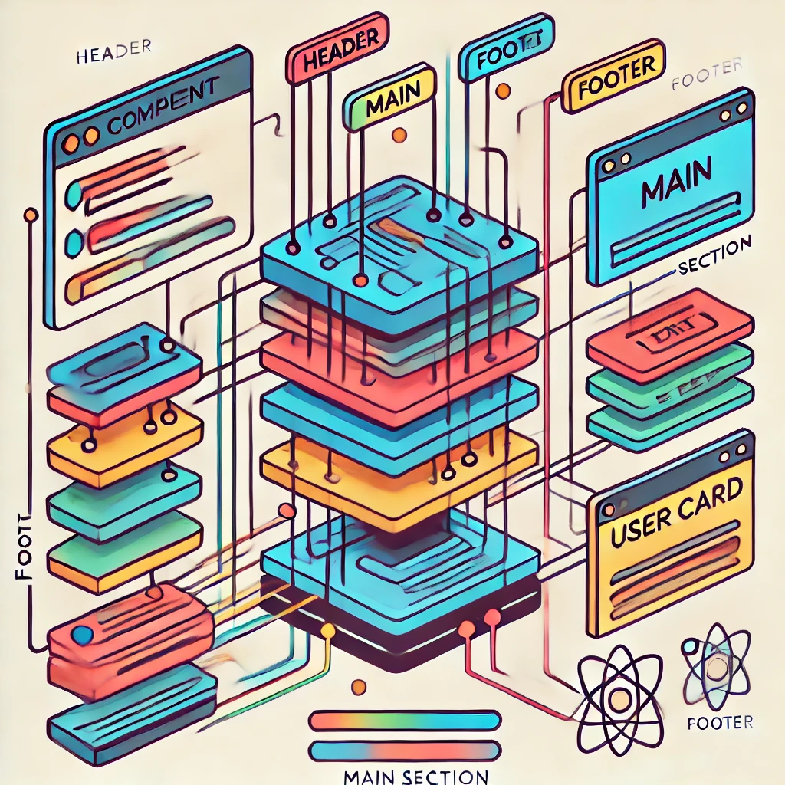

# Components
React components are small, reusable pieces of code responsible for specific parts of the application's UI. A React app is essentially a collection of these components. Components can be created using JavaScript functions or classes—functions lead to functional components, while classes create class-based components.

Traditionally, components were categorized as:

- **Functional Component / Presentational Component / Stateless Component / Dumb Component**
- **Class Component / Container Component / Stateful Component / Smart Component**

However, these distinctions are less relevant in the latest version of React, but understanding the old definitions is still valuable.

In React, components return JSX and must start with an uppercase letter. If a component's name consists of two words, it should follow CamelCase.

In the previous section, we mentioned that a website or application is composed of various elements like buttons, forms, text, media objects, headers, sections, articles, and footers. If we have a highly valuable button design, we can reuse it throughout the application instead of recreating it each time. The same applies to input fields, forms, headers, and footers. This is where the power of components comes in.

In the following diagram, the header, main, and footer are components. Within the main section, there's also a user card component and a text section component. Each color in the diagram represents a different component, and there are five components in total.



Each colored section represents a different React component, including the header, main section, user card, text section, and footer. Each component is labeled to help you visualize how they fit together.

Before diving into React components, let's take a moment to review functions and classes.

## JavaScript function

A JavaScript function can be defined as either a regular function or an arrow function. Although they are similar, there are subtle differences between the two.

```javascript
const getUserInfo = (firstName, lastName, country, title, skills, age, experienceYears, preferredLanguage) => {
return `${firstName} ${lastName}, a ${title} developer based in ${country}. 
  He is ${age} years old with ${experienceYears} years of experience. 
  His main skills include ${skills.join(', ')} and his preferred programming language is ${preferredLanguage}.`;
}
// Let's pass the parameters to call the function:
const skills = ['HTML', 'CSS', 'JavaScript', 'React', 'Node.js'];
console.log(
getUserInfo('Aytekin', 'Kaplan', 'Turkey', 'FullStack Developer', skills, 30, 7, 'JavaScript')
);
```
```shell
$ node jstest.js
Aytekin Kaplan, a FullStack Developer developer based in Turkey.
  He is 30 years old with 7 years of experience.
  His main skills include HTML, CSS, JavaScript, React, Node.js and his preferred programming language is JavaScript.
```


### 1. **Basic Greeting Function**
This function takes the user's name and returns a greeting message.

```javascript
const greetUser = (firstName, lastName) => {
  return `Hello, ${firstName} ${lastName}! Welcome to our platform.`;
}

console.log(greetUser('Aytekin', 'Kaplan'));
```

### 2. **Advanced User Information**
This function takes the user's name, age, profession, and hobbies and returns a detailed user profile.

```javascript
const getUserProfile = (firstName, lastName, age, profession, hobbies) => {
  return `${firstName} ${lastName} is a ${age}-year-old ${profession}. 
  In their free time, they enjoy ${hobbies.join(', ')}.`;
}

const hobbies = ['reading', 'coding', 'traveling', 'photography'];
console.log(getUserProfile('Aytekin', 'Kaplan', 30, 'FullStack Developer', hobbies));
```

### 3. **Shopping Cart Total Calculation**
This function takes the prices of items in a shopping cart and calculates the total price.

```javascript
const calculateTotal = (prices) => {
  return `The total price of your shopping cart is $${prices.reduce((total, price) => total + price, 0)}.`;
}

const cartPrices = [29.99, 15.99, 9.99, 49.99];
console.log(calculateTotal(cartPrices));
```

### 4. **BMI (Body Mass Index) Calculation**
This function takes the user's weight and height and calculates their Body Mass Index (BMI).

```javascript
const calculateBMI = (weight, height) => {
  const bmi = (weight / (height * height)).toFixed(2);
  return `Your BMI is ${bmi}.`;
}

console.log(calculateBMI(70, 1.75)); // 70 kg, 1.75 m height
```

### 5. **User Preferences**
This function returns a profile based on the user's preferences.

```javascript
const getUserPreferences = (username, theme, language, notifications) => {
  return `${username} prefers the ${theme} theme, uses the platform in ${language}, 
  and has notifications turned ${notifications ? 'on' : 'off'}.`;
}

console.log(getUserPreferences('Aytekin', 'dark', 'English', true));
```

### 6. **Temperature Conversion**
This function converts a Celsius value to Fahrenheit.

```javascript
const convertToFahrenheit = (celsius) => {
  return `${celsius}°C is equal to ${(celsius * 9/5 + 32).toFixed(2)}°F.`;
}

console.log(convertToFahrenheit(25)); // 25°C = 77°F
```

### 7. **Password Strength Checker**
This function takes the user's password and evaluates its strength.

```javascript
const checkPasswordStrength = (password) => {
  if (password.length >= 8 && /[A-Z]/.test(password) && /[0-9]/.test(password)) {
    return 'Your password is strong.';
  } else {
    return 'Your password could be stronger. Try including more characters, numbers, and capital letters.';
  }
}

console.log(checkPasswordStrength('Passw0rd!'));
```

### 8. **To-Do List Manager**
This function manages a task list and provides a function to add tasks.

```javascript
const addTask = (taskList, task) => {
  taskList.push(task);
  return `Task "${task}" added. You now have ${taskList.length} tasks.`;
}

let myTasks = ['Buy groceries', 'Finish project', 'Call mom'];
console.log(addTask(myTasks, 'Go for a run'));
```

These examples demonstrate how to use functions in different scenarios, each handling various types of data to solve specific problems.


